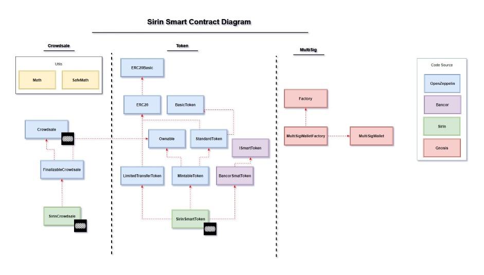

# SIRIN LABS' Crowdsale Contracts

Please see below Sirin Labs smart contracts' for the [Sirin Crowdsale][sirinlabs].


SRN is an ERC-20 compliant cryptocurrency built on top of the [Ethereum][ethereum] blockchain.

## Overview
SIRIN LABS - the developer of SOLARIN, the ultra-secure smartphone - is holding a crowdsale event. Funds raised	will	support	the	development	of	FINNEY,	the	first	open	source	smartphone	and	all-in-one	PC built for the blockchain era. Customers will be able to purchase all SIRIN LABS products (SOLARIN and FINNEY) with SIRIN LABS token, the SRN.

## Contracts

Please see the [contracts/](contracts) directory.

## The Crowdsale Specification
*	SRN token is ERC-20 compliant.
*	SRN Token is [Bancor][bancor] compliant.
*	Token allocation:
	* 40% of the total number of SRN tokens will be allocated to contributors during the token sale.
	* 10% of the total number of SRN tokens will be allocated to the team.
	* 10% of the total number of SRN tokens will be allocated to OEMs, Operating System implementation, SDK developers and rebate of sold devices.
	* 5% of the total number of SRN tokens will be allocated to professional fees and bounties.
	* 35% of the total number of SRN tokens will be allocated to SIRIN LABS, to be used for future strategic plans and to develop the SIRIN LABS' ecosystem.

## SRN PRICING PROGRAM

| Duration from token Crowdsale event start	| SRN / ETH |
| :---: | :---: |
| First 24 hours | 1000 |
| 2nd day | 950 |
| 3rd day | 900 |
| 4th day | 855 |
| 5th day | 810 |
| 6th day | 770 |
| 7th day | 730 |
| 8th day | 690 |
| 9th day | 650 |
| 10th day | 615 |
| 11th day | 580 |
| 12th day | 550 |
| 13th day | 525 |
| 14th day | 500 |

#### Refund Route - SRN tokens with guarantee

Investors can choose to buy SRN tokens with guarantee.

refund route rates are 50% of the regular rate (starting from 500 SRNs for 1 ETH at the first day and ending at 250 SRNs for 1 ETH at the last day of the crowd sale).

SRN tokens and the ETH funds are deposited to a RefundVault contract owned by the SirinCrowdsale contract.

Investors bought SRNs on the refund route can get refund of their ETH or claim their SRN tokens only after the crowd sale ends.

Refund ETH period is limited to 60 days after the crowd sale ends. SRN token claim is not limited in time.

Any of the actions (refund ETH and SRN token claim) can be executed by the investor directly on the RefundVault contract.

Any of the actions (refund ETH and SRN token claim) can be done on parts of the amount.

* In case of refund ETH, the proportional amount of SRN tokens will be burned.
* In case of SRN token claim, the proportional amount of ETH will be transferred to Sirin ETH Wallet.
* In Case of partial action the remaining ETH and SRN tokens will be available to more refund or claim actions according to the refund period and updated amounts.


## Develop

* Contracts are written in [Solidity][solidity] and tested using [Truffle][truffle] and [testrpc][testrpc].

* Our smart contract is based on [Open Zeppelin][openzeppelin] smart contracts [v1.3.0][openzeppelin_v1.3.0] (latest OZ commit merged is 8e01dd14f9211239213ae7bd4c6af92dd18d4ab7 from 24.10.2017).

* SRN token is a **SmartToken**, implementing Bancor's SmartToken contract.

## Audit

The crowdsale contracts were audited by [Matthew di Ferrante][mattdf] and [Dean Eigenmann][decnus].

The audit report can be viewed [here](audit/sirin-audit.pdf).

## Code

#### Class Diagram  




#### SirinCrowdsale Functions

**getRate**
```cs
function getRate() public view returns (uint256)
```
Returns the rate in SRN per 1 ETH according to the time of the tx and the SRN pricing program.

**getTotalFundsRaised**
```cs
function getTotalFundsRaised() public view returns (uint256)
```
Returns the total funds collected in wei(ETH and none ETH).

**addUpdateGrantee**
```cs
function addUpdateGrantee(address _grantee, uint256 _value) external onlyOwner onlyWhileSale
```
Adds/Updates address and token allocation for token grants.

Granted tokens are allocated to non-ether, presale, buyers.

**isActive**
```cs
function isActive() public view returns (bool)
```
Return true if the crowdsale is active, hence users can buy tokens

**deleteGrantee**
```cs
function deleteGrantee(address _grantee) external onlyOwner onlyWhileSale
```
Deletes entries from the grants list.

**setFiatRaisedConvertedToWei**
```cs
function setFiatRaisedConvertedToWei(uint256 _fiatRaisedConvertedToWei) external onlyOwner onlyWhileSale
```
Sets funds collected outside the crowdsale in wei.
funds are converted to wei using the market conversion rate of USD\ETH on the day on the purchase.

**claimTokenOwnership**
```cs
function claimTokenOwnership() external onlyOwner
```
Accepts new ownership on behalf of the SirinCrowdsale contract. This can be used, by the token sale contract itself to claim back ownership of the SirinSmartToken contract.

**claimRefundVaultOwnership**
```cs
function claimRefundVaultOwnership() external onlyOwner
```
Accepts new ownership on behalf of the SirinCrowdsale contract. This can be used, by the token sale contract itself to claim back ownership of the refundVault contract.

**buyTokensWithGuarantee**
```cs
function buyTokensWithGuarantee() public payable
```
Buy tokes with guarantee, these tokens and the ETH are saved in refundVault, so investor can refund them up to 60 days after the crowdsale ends.

#### SirinCrowdsale Events

**GrantAdded**
```cs
event GrantAdded(address indexed _grantee, uint256 _amount);
```


**GrantUpdated**
```cs
event GrantUpdated(address indexed _grantee, uint256 _oldAmount, uint256 _newAmount);
```


**GrantDeleted**
```cs
event GrantDeleted(address indexed _grantee, uint256 _hadAmount);
```


**FiatRaisedUpdated**
```cs
event FiatRaisedUpdated(address indexed _address, uint256 _fiatRaised)
```


**TokenPurchaseWithGuarantee**
```cs
event TokenPurchaseWithGuarantee(address indexed purchaser, address indexed beneficiary, uint256 value, uint256 amount);
```

#### RefundVault Functions

**deposit**
```cs
function deposit(address investor, uint256 tokensAmount) onlyOwner public payable
```
Adds Investor tokens and ETH to the vault.

**close**
```cs
function close() onlyOwner public
```
Closes the refunds, all ETH is transfered to Sirin ETH wallet.
After this function is called investors cannot refund their ETH anymore but can claim their tokens.

**enableRefunds**
```cs
function enableRefunds() onlyOwner public
```
Start the refunding. Should be called after the crowdsale.

**refundETH**
```cs
function refundETH(uint256 ETHToRefundAmountWei) isInRefundTimeFrame isRefundingState public
```
Refund ETH back to the investor in return of proportional amount of SRN back to Sirin wallet.

**claimTokens**
```cs
function claimTokens(address investor, uint256 tokensToClaim) isRefundingOrCloseState public
```
Transfer tokens from the vault to the investor while transferring proportional amount of ETH to Sirin ETH wallet.

Can be triggered by the investor only.

**claimAllTokens**
```cs
function claimAllTokens() public
```
Investors can claim all remaining tokens from the vault.

#### RefundVault Events

**Active**
```cs
event Active();
```


**Deposit**
```cs
event Deposit(address indexed beneficiary, uint256 etherWeiAmount, uint256 tokenWeiAmount);
```    

**Closed**
```cs
event Closed();
```


**RefundsEnabled**
```cs
event RefundsEnabled();
```


**RefundedETH**
```cs
event RefundedETH(address indexed beneficiary, uint256 weiAmount);
```


**TokensClaimed**
```cs
event TokensClaimed(address indexed beneficiary, uint256 weiAmount);
```

### Dependencies

```bash
# Install Truffle and testrpc packages globally:
$ npm install -g truffle ethereumjs-testrpc

# Install local node dependencies:
$ npm install
```

### Test

```bash
$ ./scripts/test.sh
```


### Code Coverage

```bash
$ ./scripts/coverage.sh
```

## Collaborators

* **[Yossi Gruner](https://github.com/yossigruner)**
* **[Gilad Or](https://github.com/gilador)**
* **[Yaron Shlomo](https://github.com/yaronshlomo)**
* **[Lior David](https://github.com/liordavid)**


## License

Apache License v2.0


[sirinlabs]: https://www.sirinlabs.com
[ethereum]: https://www.ethereum.org/

[solidity]: https://solidity.readthedocs.io/en/develop/
[truffle]: http://truffleframework.com/
[testrpc]: https://github.com/ethereumjs/testrpc
[bancor]: https://github.com/bancorprotocol/contracts
[openzeppelin]: https://openzeppelin.org
[openzeppelin_v1.3.0]: https://github.com/OpenZeppelin/zeppelin-solidity/releases/tag/v1.3.0
[mattdf]: http://github.com/mattdf
[decnus]: http://github.com/decanus
